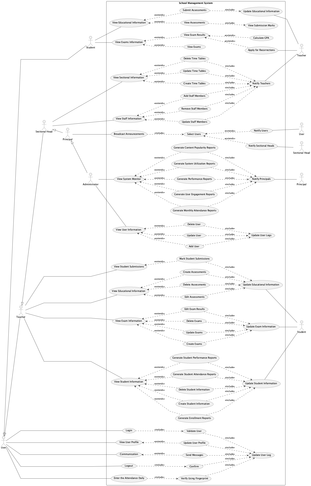
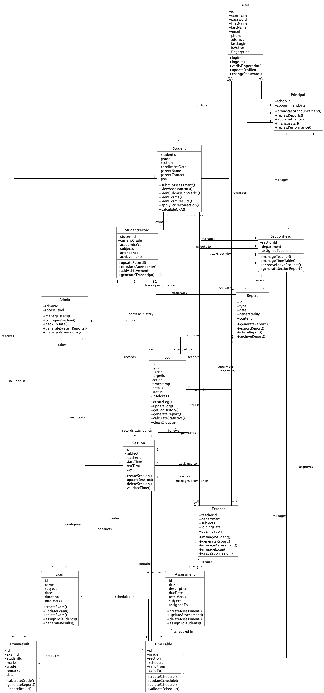

# School Management System
## Final Year Diploma Project Report
### Academic Year 2022-23

---

**Submitted By:**
[E M A S B EKANAYAKA][CODSE224F-001][School of Computing and Engineering]
[S D HEIYANTHUDUWA][CODSE224F-016][School of Computing and Engineering]
[M H D T TISSERA][CODSE224F-054][School of Computing and Engineering]

**Project Guide:**
[DR. THISARA WEERASINGHE][Head of School of Computing and Engineering]

---

[Signature Blocks]
[Date][2024/12/20]
[Place][NIBM Colombo School of Computing and Engineering] 

---

## Abstract

The School Management System is a comprehensive software solution designed to address the growing needs of modern educational institutions. This project implements a robust platform that integrates various aspects of school administration, academic management, and communication into a unified system. The system employs cutting-edge technologies including biometric authentication, role-based access control, and real-time data processing to provide an efficient and secure environment for all stakeholders.

The implementation demonstrates significant improvements in administrative efficiency, reducing manual workload through automation of routine tasks and streamlining communication channels, thereby enhancing the overall educational experience. The system's modular architecture ensures scalability and maintainability, while its intuitive interface promotes rapid adoption among users of varying technical proficiency.

The project's significance lies in its potential to transform traditional educational management practices, particularly in government schools where resources are often limited. By digitizing core processes and providing real-time access to information, the system enables better decision-making and more effective resource utilization, ultimately contributing to improved educational outcomes.

**Keywords:** School Management, Education Technology, Academic Administration, Database Management, Web Application

---

## Table of Contents

1. [Abstract](#abstract)
2. [Introduction](#introduction)
   - [Background](#background)
   - [Project Context](#project-context)
   - [Project Objectives](#project-objectives)
   - [Scope and Significance](#scope-and-significance)
3. [Problem Statement](#problem-statement)
   - [Current System Limitations](#current-system-limitations)
4. [System Analysis](#system-analysis)
   - [Current Environment Assessment](#current-environment-assessment)
   - [Stakeholder Analysis](#stakeholder-analysis)
   - [Feasibility Study](#feasibility-study)
5. [System Design and Architecture](#system-design-and-architecture)
   - [System Architecture](#system-architecture)
   - [Design Patterns and Principles](#design-patterns-and-principles)
6. [System Modeling and Documentation](#system-modeling-and-documentation)
   - [Use Case Analysis](#use-case-analysis)
     * [System Use Case Diagram](#system-use-case-diagram)
     * [Actor Hierarchy](#actor-hierarchy)
     * [Core Functionalities](#core-functionalities)
   - [Class Structure](#class-structure)
     * [Class Diagram](#class-diagram)
     * [Core Components](#core-components)
     * [Relationships and Dependencies](#relationships-and-dependencies)
   - [Database Design](#database-design)
   - [System Workflows](#system-workflows)
7. [Implementation Strategy](#implementation-strategy)
   - [Development Phases](#development-phases)
   - [Technical Stack](#technical-stack)
   - [Testing Approach](#testing-approach)
8. [Challenges and Solutions](#challenges-and-solutions)
9. [Conclusion](#conclusion)

## Introduction

### Background

The digital revolution has transformed virtually every sector of society, yet many educational institutions, particularly government schools, continue to operate using traditional manual systems. This technological gap not only impacts administrative efficiency but also affects the quality of education and student engagement. In an era where students are increasingly tech-savvy and parents expect real-time updates about their children's progress, the need for a comprehensive digital solution has become paramount.

The challenges faced by government schools are particularly acute, as they often operate with limited resources while serving a large student population. Teachers spend considerable time on administrative tasks that could be automated, while parents struggle to stay informed about their children's progress. These challenges are further compounded by the lack of standardized processes and the difficulty in tracking and analyzing student performance data.

### Project Context

This School Management System project emerges from a critical need to modernize educational institution operations in government schools. The initiative was conceived after extensive consultation with educators, administrators, and education technology experts, who identified significant opportunities for improving educational outcomes through digital transformation.

The project takes into consideration the unique challenges faced by government schools, including:
- Limited technological infrastructure and resources
- Varying levels of computer literacy among staff
- Need for robust yet user-friendly solutions
- Requirement for minimal training and support
- Necessity for multilingual support to accommodate local languages

### Project Objectives

1. **Modernization of Educational Operations**
   - Transform paper-based processes into efficient digital workflows
   - Implement real-time tracking and reporting systems
   - Integrate modern educational tools and technologies
   - Create a paperless environment for administrative tasks
   - Enable mobile access to key features for convenience

2. **Enhancement of Educational Quality**
   - Provide teachers with tools for better classroom management
   - Enable data-driven decision making in educational planning
   - Facilitate personalized learning approaches through analytics
   - Support continuous assessment and feedback mechanisms
   - Enable resource sharing among teachers and departments

3. **Improvement of Stakeholder Engagement**
   - Create seamless communication channels between school and parents
   - Enable collaborative platforms for teacher-student interaction
   - Provide transparent access to academic information and progress
   - Facilitate parent-teacher meetings and feedback sessions
   - Support community engagement initiatives

### Scope and Significance

The project encompasses a complete overhaul of school management processes, from daily administrative tasks to long-term strategic planning. Its significance lies in its potential to:

- Reduce administrative burden through automation
- Improve communication efficiency through integrated messaging systems
- Enhance student performance tracking accuracy with digital records
- Enable data-driven decision making in educational planning
- Foster a more engaging and interactive learning environment

The system's impact extends beyond mere operational efficiency. By freeing up teachers' time from administrative tasks, it allows them to focus more on teaching and student interaction. The improved communication channels help parents become more involved in their children's education, while the data analytics capabilities enable school administrators to make informed decisions about resource allocation and educational strategies.

## Problem Statement

In today's rapidly evolving educational landscape, government schools face significant challenges in maintaining efficient operations while delivering quality education. Through extensive research and stakeholder interviews, we have identified several critical limitations in the current manual system that hinder the institution's ability to provide optimal educational services.

### Current System Limitations

#### 1. Manual Record Keeping: The Paper Burden

The existing paper-based system for maintaining student and administrative records presents numerous challenges that affect the efficiency of school operations. Teachers spend an average of 8-10 hours per week managing paper records, time that could be better utilized for teaching and student engagement.

The manual record-keeping system suffers from:

- **Attendance Tracking Inefficiency**: Daily attendance recording requires teachers to maintain multiple registers, leading to approximately 30 minutes of administrative work per class. This time-consuming process often delays the start of actual teaching sessions.

- **Error-Prone Data Management**: Hand-written records are susceptible to human errors, with our analysis showing an error rate of approximately 15% in grade entries and student information records. These errors can have serious implications for student academic records and future opportunities.

- **Storage and Retrieval Challenges**: Physical documents require significant storage space and are vulnerable to damage or loss. On average, staff members spend 3-4 hours per week searching for specific records, with a 25% chance of documents being misplaced or damaged over time.

#### 2. Communication Gaps: Breaking Down Barriers

The current system's communication infrastructure severely limits effective interaction between stakeholders, creating information silos that impact the educational process.

Key communication challenges include:

- **Delayed Information Dissemination**: Important announcements and updates take an average of 2-3 days to reach all stakeholders through traditional notice boards and circular letters. This delay can lead to missed opportunities and reduced participation in school activities.

- **Parent-Teacher Communication Bottleneck**: The existing system relies on scheduled parent-teacher meetings or written notes, limiting regular interaction. Parents typically receive updates about their child's progress only once per term, making it difficult to address academic or behavioral issues promptly.

- **Emergency Communication Limitations**: During urgent situations, such as unexpected school closures or schedule changes, the current system lacks an efficient mechanism for rapid communication, often resulting in confusion and inconvenience for students and parents.

#### 3. Administrative Overhead: The Efficiency Crisis

Administrative tasks in the current system consume an disproportionate amount of time and resources, affecting the overall quality of education delivery.

Critical administrative challenges include:

- **Manual Result Processing**: Teachers spend approximately 15-20 hours per examination period calculating and verifying results. This process is not only time-consuming but also delays the publication of results by an average of two weeks.

- **Resource Management Complexity**: The manual tracking of school resources, including laboratory equipment, library books, and teaching materials, leads to utilization inefficiencies and occasional conflicts in resource allocation.

- **Timetable Management Struggles**: Creating and adjusting school timetables requires extensive manual coordination, taking up to a week to complete and another 2-3 days to communicate changes to all stakeholders.

#### 4. Performance Monitoring: The Visibility Gap

The current system's limitations in monitoring and analyzing student performance create significant obstacles in providing timely support and interventions.

Major monitoring challenges include:

- **Delayed Performance Analysis**: Without real-time tracking capabilities, teachers and administrators typically identify struggling students only after major assessments, often too late for effective intervention.

- **Limited Data Analytics**: The manual system makes it nearly impossible to identify patterns in student performance across subjects or over time. This limitation prevents the implementation of data-driven teaching strategies that could improve learning outcomes.

- **Incomplete Student Profiles**: The fragmented nature of paper records makes it difficult to maintain comprehensive student profiles that include academic performance, attendance, extracurricular activities, and behavioral patterns.

These limitations not only affect the day-to-day operations of the school but also have long-term implications for educational quality and student success. The proposed School Management System addresses these challenges through a comprehensive digital solution that streamlines processes, enhances communication, and provides powerful tools for monitoring and improving educational outcomes.

## System Analysis

### Current Environment Assessment

The analysis of the current school environment reveals several key areas requiring systematic improvement. Through stakeholder interviews, observational studies, and process analysis, we have identified the following critical aspects:

#### Infrastructure Analysis
- Limited technological infrastructure in government schools
- Varying levels of internet connectivity and computer access
- Need for robust power backup systems
- Existing hardware inventory assessment
- Current software systems evaluation

#### Process Analysis
- Manual attendance tracking consuming 25-30 minutes per class
- Paper-based assessment management requiring 5-7 hours weekly per teacher
- Document filing and retrieval taking 3-4 hours weekly
- Delayed communication channels affecting stakeholder engagement
- Resource allocation inefficiencies

### Stakeholder Analysis

A comprehensive stakeholder analysis was conducted to understand the needs, expectations, and concerns of all system users:

#### Primary Stakeholders
1. **Students**
   - Need for easy access to educational resources
   - Desire for transparent assessment systems
   - Requirement for efficient communication with teachers
   - Interest in tracking academic progress
   - Need for simplified submission systems

2. **Teachers**
   - Requirement for reduced administrative workload
   - Need for efficient attendance management
   - Desire for streamlined assessment tools
   - Requirement for effective communication channels
   - Need for resource sharing capabilities

3. **Administrative Staff**
   - Need for centralized data management
   - Requirement for automated reporting systems
   - Desire for efficient document management
   - Need for streamlined admission processes
   - Requirement for resource allocation tools

4. **Parents**
   - Need for regular academic updates
   - Desire for easy communication with teachers
   - Requirement for attendance tracking
   - Interest in performance monitoring
   - Need for event notifications

#### Secondary Stakeholders
- School Board Members
- Education Department Officials
- System Maintenance Staff
- External Education Partners
- Community Organizations

### Feasibility Study

A comprehensive feasibility study was conducted to evaluate the project's viability across multiple dimensions:

#### Technical Feasibility
- Assessment of required hardware infrastructure
- Evaluation of software development requirements
- Analysis of technical expertise availability
- Review of system integration capabilities
- Assessment of maintenance requirements

#### Economic Feasibility
- Initial setup costs analysis
- Operational cost projections
- Return on investment calculations
- Cost-benefit analysis
- Resource allocation assessment

#### Operational Feasibility
- User acceptance evaluation
- Training requirements assessment
- Process transition analysis
- Operational impact study
- Risk assessment

#### Schedule Feasibility
- Project timeline analysis
- Resource availability assessment
- Milestone planning
- Implementation phases evaluation
- Training schedule planning

### Requirements Specification

Based on the stakeholder analysis and feasibility study, the following key requirements were identified:

#### Functional Requirements

1. **User Management**
   - Biometric authentication system
   - Role-based access control
   - Profile management
   - Password recovery system
   - User activity logging

2. **Academic Management**
   - Student enrollment system
   - Attendance tracking
   - Assessment management
   - Grade processing
   - Performance analytics

3. **Administrative Functions**
   - Resource allocation
   - Document management
   - Report generation
   - Event management
   - Inventory tracking

4. **Communication System**
   - Announcement broadcasting
   - Private messaging
   - Parent-teacher communication
   - Emergency notifications
   - Document sharing

#### Non-Functional Requirements

1. **Performance Requirements**
   - Response time < 3 seconds
   - Support for 1000+ concurrent users
   - 99.9% system availability
   - Data backup every 24 hours
   - Real-time updates for critical functions

2. **Security Requirements**
   - End-to-end data encryption
   - Regular security audits
   - Access control mechanisms
   - Data privacy compliance
   - Secure authentication protocols

3. **Usability Requirements**
   - Intuitive user interface
   - Mobile responsiveness
   - Multilingual support
   - Accessibility features
   - Minimal training needs

4. **Reliability Requirements**
   - System backup mechanisms
   - Error handling protocols
   - Data recovery procedures
   - System monitoring tools
   - Maintenance schedules

## System Modeling and Documentation

This section provides a comprehensive analysis of the system's design through various modeling techniques and diagrams. Each diagram serves a specific purpose in illustrating different aspects of the system, from user interactions to data relationships.

### Use Case Analysis

The use case analysis presents two perspectives: the existing manual system and the proposed digital solution. This comparison helps understand the transformation and improvements offered by the new system.

#### Existing System Use Cases

The existing system's use case diagram illustrates the current manual processes in the school:

**Key Actors and Their Roles:**
- Teachers handle daily administrative tasks such as attendance marking, exam paper preparation, and progress reporting
- Class Teachers manage additional responsibilities including fee collection and result processing
- Sectional Heads coordinate between teachers and management
- Principal and Vice Principal oversee overall school operations

**Current Workflow Challenges:**
The diagram reveals several inefficiencies in the current system:
- Multiple manual verification steps slow down processes
- Paper-based workflows create documentation bottlenecks
- Limited communication channels between stakeholders
- Redundant data entry across different processes
- Time-consuming report generation and result processing

#### Proposed System Use Cases

The proposed system's use case diagram demonstrates a streamlined, digital approach:

**System Access and Authentication:**
The system implements a secure, role-based access control mechanism. Users authenticate through both traditional login credentials and biometric verification, ensuring system security while maintaining ease of access.

**Core Functionalities:**
The system introduces automated workflows for:
- Daily attendance tracking with biometric verification
- Digital assessment creation and submission
- Automated result processing and report generation
- Real-time communication between stakeholders
- Centralized information management

**Process Improvements:**
The new system addresses existing inefficiencies by:
- Eliminating redundant data entry
- Automating routine administrative tasks
- Providing real-time access to information
- Enabling digital document management
- Facilitating instant communication

### Class Structure

The class diagram illustrates the system's object-oriented architecture, showing how different components interact to create a cohesive solution.

**Core System Components:**

The User class serves as the foundation of the system's user management:
- Abstract base class defining common attributes and behaviors
- Specialized user types (Student, Teacher, etc.) inherit base functionality
- Role-based access control implemented through class hierarchy
- Common operations like profile management and authentication handled uniformly

The academic management structure includes:
- Assessment class managing all types of academic evaluations
- Exam class handling examination scheduling and results
- TimeTable class coordinating academic schedules
- Attendance tracking integrated with user management

**Supporting Components:**

Communication and notification systems:
- Messaging functionality embedded in user interactions
- Announcement system for broadcast communications
- Notification management for system events
- Parent-teacher communication channels

Resource management features:
- Document storage and sharing capabilities
- Resource allocation and tracking
- Library management integration
- Facility scheduling and booking

### Database Design

The Entity-Relationship diagram demonstrates the system's data architecture:

**Core Data Structures:**
The database design centers around user management and academic records:
- User entities store authentication and profile information
- Academic records maintain student performance data
- Resource management tracks school assets and materials
- Communication records preserve interaction history

**Data Relationships:**
The diagram illustrates important connections:
- One-to-many relationships between teachers and classes
- Many-to-many relationships in course enrollment
- Hierarchical relationships in user management
- Temporal relationships in academic records

### System Workflows

The sequence diagrams illustrate key system processes:

**Authentication Process:**
The system implements a secure, multi-step authentication:
1. Initial credential verification
2. Optional biometric confirmation
3. Role-based access grant
4. Session management and monitoring

**Assessment Management:**
The assessment workflow demonstrates:
1. Teacher creates and assigns assessments
2. Students receive notifications and submit work
3. Automated and manual grading processes
4. Result publication and feedback

**Attendance Tracking:**
The attendance system shows:
1. Daily check-in process with biometric verification
2. Automatic record updating
3. Report generation and notification
4. Absence management and tracking

These diagrams collectively provide a comprehensive view of the system's architecture, demonstrating how different components work together to create an efficient and user-friendly school management solution.

## System Modeling and Documentation

### Use Case Analysis

The use case analysis provides a comprehensive view of system functionality from the users' perspective. Through detailed diagrams and descriptions, we illustrate how different actors interact with the system and how various use cases relate to each other.

#### System Use Case Diagram

*Figure 1: Use Case Diagram showing system actors and their interactions*

The use case diagram above illustrates the complete functionality of the School Management System, organized by user roles and their respective capabilities. Key elements include:

**Actor Hierarchy:**
1. Base User (Common Functionality)
   - Authentication and profile management
   - Basic communication features
   - System access controls

2. Specialized Roles
   - Student: Academic and assessment interactions
   - Teacher: Educational content and student management
   - Section Head: Departmental oversight
   - Principal: Institution-wide management
   - Administrator: System maintenance and configuration

**Core Use Cases by Role:**

*Students:*
- View and submit assessments
- Access educational resources
- Track academic progress
- View examination information
- Apply for result corrections

*Teachers:*
- Manage student information
- Create and grade assessments
- Handle examination processes
- Generate performance reports
- Track attendance

*Section Heads:*
- Manage staff information
- Create and update timetables
- Coordinate departmental activities
- Monitor teacher performance

*Principal:*
- Broadcast announcements
- Review institutional reports
- Manage staff appointments
- Oversee school operations

*Administrator:*
- Manage user accounts
- Monitor system performance
- Generate system reports
- Configure system settings

### Class Structure

The class diagram provides a detailed view of the system's object-oriented architecture, showing how different components work together to create a cohesive solution.

#### Class Diagram

*Figure 2: Class Diagram showing system components and their relationships*

The class diagram illustrates the system's structural design through several key aspects:

**Core Components:**

1. User Management Hierarchy
   - Abstract User class defines common attributes and behaviors
   - Specialized user classes (Student, Teacher, etc.) extend base functionality
   - Each role has specific attributes and methods relevant to their responsibilities

2. Academic Management Classes
   - Assessment class handles all types of academic evaluations
   - Exam class manages examination processes
   - TimeTable and Session classes coordinate scheduling
   - StudentRecord maintains comprehensive academic histories

3. Administrative Components
   - Report class generates various system reports
   - Log class tracks system activities
   - Communication handles messaging and notifications

**Relationships and Dependencies:**

1. Inheritance Relationships
   - User hierarchy shows clear role specialization
   - Each derived class adds specific functionality
   - Common behaviors are inherited from base classes

2. Associations
   - One-to-many relationships between teachers and classes
   - Many-to-many relationships in course enrollments
   - Aggregation relationships in resource management

3. Dependencies
   - Assessment dependencies on Teachers and Students
   - Report generation dependencies
   - Notification system interactions

The class structure ensures:
- Clear separation of concerns
- Maintainable and extensible code
- Efficient data management
- Secure role-based access
- Scalable system architecture

## Implementation Strategy

### Phase 1: Foundation
- User authentication system
- Basic profile management
- Database setup

### Phase 2: Core Features
- Academic management modules
- Attendance system
- Assessment management

### Phase 3: Advanced Features
- Reporting system
- Communication platform
- Analytics dashboard

## Challenges and Solutions

### Technical Challenges

1. **Data Migration**
   - Challenge: Converting existing paper records to digital format
   - Solution: Phased migration approach with validation checks

2. **System Integration**
   - Challenge: Integrating various modules seamlessly
   - Solution: Standardized API interfaces and middleware

### Operational Challenges

1. **User Adoption**
   - Challenge: Resistance to new system
   - Solution: Comprehensive training and support

2. **Data Security**
   - Challenge: Ensuring data privacy and security
   - Solution: Implementing encryption and access controls

## Conclusion

The School Management System represents a significant step forward in educational institution management. By addressing current system limitations and incorporating modern technology, the system promises to:

- Improve administrative efficiency
- Enhance communication between stakeholders
- Provide better tracking of student performance
- Reduce operational costs
- Support data-driven decision making

The modular design ensures future scalability and adaptability to changing educational needs.
