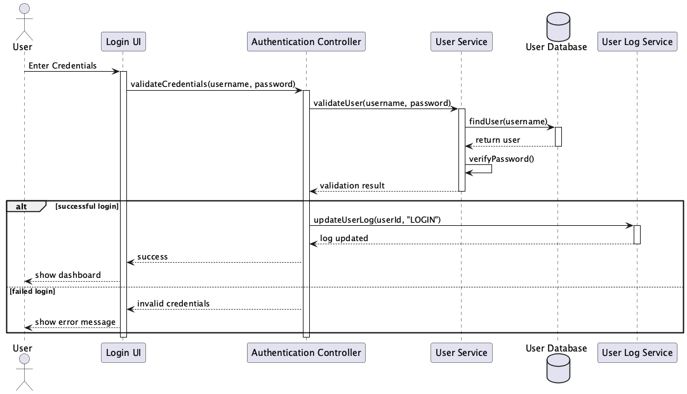
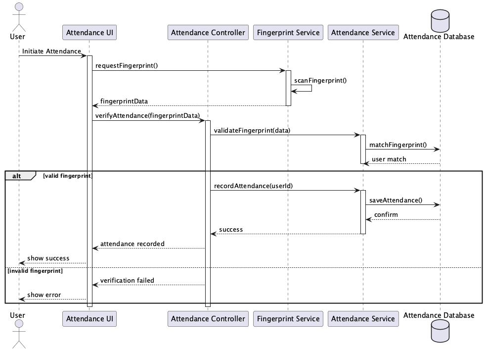
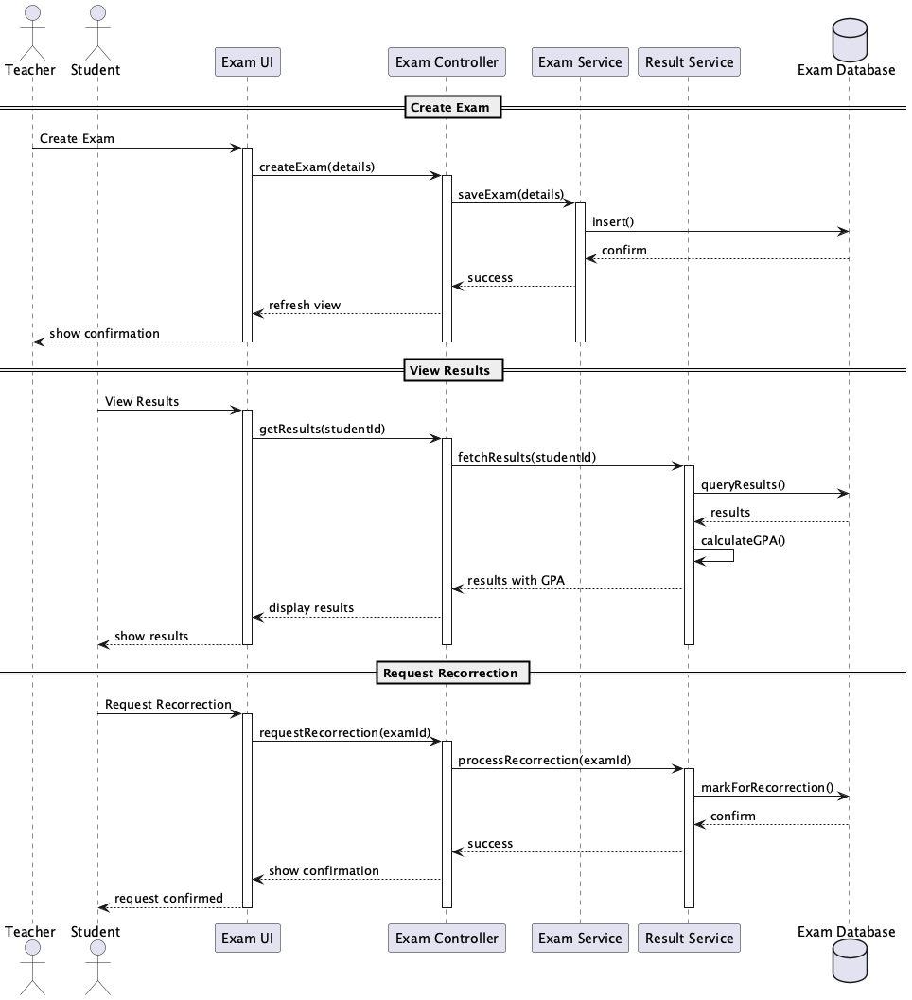
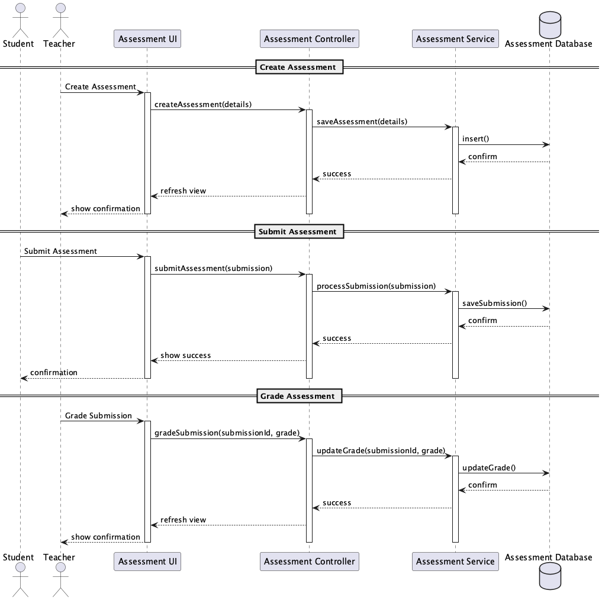
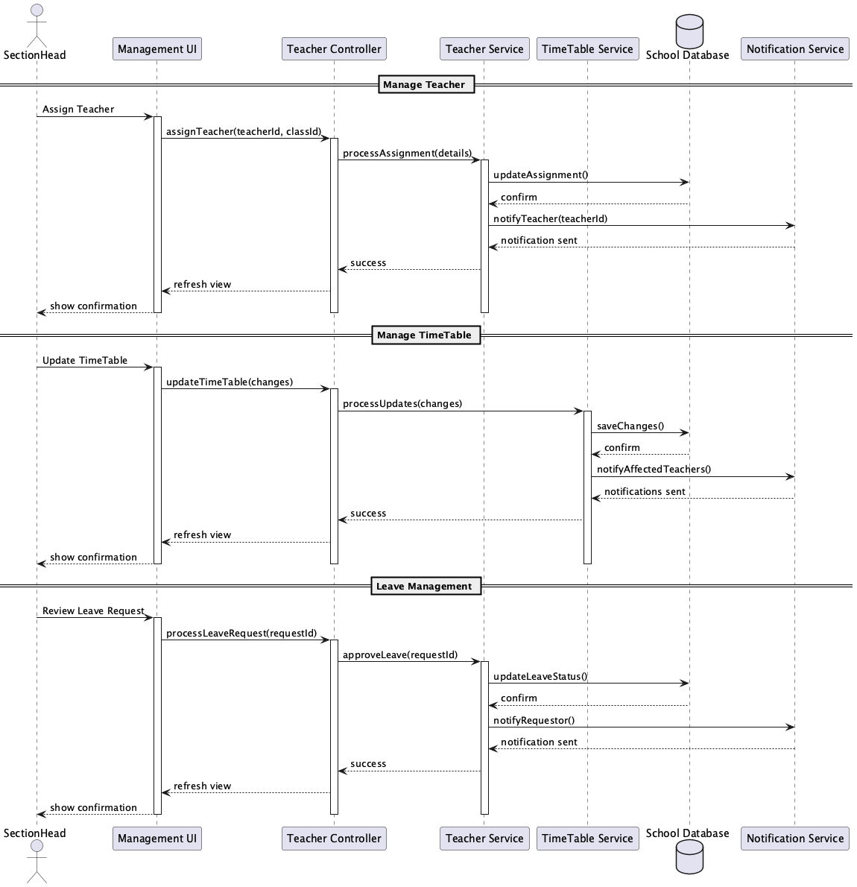

# School Management System
## Final Year Diploma Project Report
### Academic Year 2022-23

---

**Submitted By:**
[E M A S B EKANAYAKA][CODSE224F-001][School of Computing and Engineering]
[S D HEIYANTHUDUWA][CODSE224F-016][School of Computing and Engineering]
[M H D T TISSERA][CODSE224F-054][School of Computing and Engineering]

**Project Guide:**
[DR. THISARA WEERASINGHE][Head of School of Computing and Engineering]

---

[Signature Blocks]
[Date][2024/12/20]
[Place][NIBM Colombo School of Computing and Engineering] 

---

## Abstract

The School Management System is a comprehensive software solution designed to address the growing needs of modern educational institutions. This project implements a robust platform that integrates various aspects of school administration, academic management, and communication into a unified system. The system employs cutting-edge technologies including biometric authentication, role-based access control, and real-time data processing to provide an efficient and secure environment for all stakeholders.

The implementation demonstrates significant improvements in administrative efficiency, reducing manual workload through automation of routine tasks and streamlining communication channels, thereby enhancing the overall educational experience. The system's modular architecture ensures scalability and maintainability, while its intuitive interface promotes rapid adoption among users of varying technical proficiency.

The project's significance lies in its potential to transform traditional educational management practices, particularly in government schools where resources are often limited. By digitizing core processes and providing real-time access to information, the system enables better decision-making and more effective resource utilization, ultimately contributing to improved educational outcomes.

**Keywords:** School Management, Education Technology, Academic Administration, Database Management, Web Application

---

## Table of Contents

1. [Abstract](#abstract)
2. [Introduction](#introduction)
   - [Background](#background)
   - [Project Context](#project-context)
   - [Project Objectives](#project-objectives)
   - [Scope and Significance](#scope-and-significance)
3. [Problem Statement](#problem-statement)
   - [Current System Limitations](#current-system-limitations)
4. [System Analysis](#system-analysis)
   - [Current Environment Assessment](#current-environment-assessment)
   - [Stakeholder Analysis](#stakeholder-analysis)
   - [Feasibility Study](#feasibility-study)
5. [System Design and Architecture](#system-design-and-architecture)
   - [System Architecture](#system-architecture)
   - [Design Patterns and Principles](#design-patterns-and-principles)
6. [System Modeling and Documentation](#system-modeling-and-documentation)
   - [Use Case Analysis](#use-case-analysis)
     * [System Use Case Diagram](#system-use-case-diagram)
     * [Actor Hierarchy](#actor-hierarchy)
     * [Core Functionalities](#core-functionalities)
   - [Class Structure](#class-structure)
     * [Class Diagram](#class-diagram)
     * [Core Components](#core-components)
     * [Relationships and Dependencies](#relationships-and-dependencies)
   - [Database Design](#database-design)
   - [System Workflows](#system-workflows)
7. [Implementation Strategy](#implementation-strategy)
   - [Development Phases](#development-phases)
   - [Technical Stack](#technical-stack)
   - [Testing Approach](#testing-approach)
8. [Challenges and Solutions](#challenges-and-solutions)
9. [Conclusion](#conclusion)

## Introduction

### Background

The digital revolution has transformed virtually every sector of society, yet many educational institutions, particularly government schools, continue to operate using traditional manual systems. This technological gap not only impacts administrative efficiency but also affects the quality of education and student engagement. In an era where students are increasingly tech-savvy and parents expect real-time updates about their children's progress, the need for a comprehensive digital solution has become paramount.

The challenges faced by government schools are particularly acute, as they often operate with limited resources while serving a large student population. Teachers spend considerable time on administrative tasks that could be automated, while parents struggle to stay informed about their children's progress. These challenges are further compounded by the lack of standardized processes and the difficulty in tracking and analyzing student performance data.

### Project Context

This School Management System project emerges from a critical need to modernize educational institution operations in government schools. The initiative was conceived after extensive consultation with educators, administrators, and education technology experts, who identified significant opportunities for improving educational outcomes through digital transformation.

The project takes into consideration the unique challenges faced by government schools, including:
- Limited technological infrastructure and resources
- Varying levels of computer literacy among staff
- Need for robust yet user-friendly solutions
- Requirement for minimal training and support
- Necessity for multilingual support to accommodate local languages

### Project Objectives

1. **Modernization of Educational Operations**
   - Transform paper-based processes into efficient digital workflows
   - Implement real-time tracking and reporting systems
   - Integrate modern educational tools and technologies
   - Create a paperless environment for administrative tasks
   - Enable mobile access to key features for convenience

2. **Enhancement of Educational Quality**
   - Provide teachers with tools for better classroom management
   - Enable data-driven decision making in educational planning
   - Facilitate personalized learning approaches through analytics
   - Support continuous assessment and feedback mechanisms
   - Enable resource sharing among teachers and departments

3. **Improvement of Stakeholder Engagement**
   - Create seamless communication channels between school and parents
   - Enable collaborative platforms for teacher-student interaction
   - Provide transparent access to academic information and progress
   - Facilitate parent-teacher meetings and feedback sessions
   - Support community engagement initiatives

### Scope and Significance

The project encompasses a complete overhaul of school management processes, from daily administrative tasks to long-term strategic planning. Its significance lies in its potential to:

- Reduce administrative burden through automation
- Improve communication efficiency through integrated messaging systems
- Enhance student performance tracking accuracy with digital records
- Enable data-driven decision making in educational planning
- Foster a more engaging and interactive learning environment

The system's impact extends beyond mere operational efficiency. By freeing up teachers' time from administrative tasks, it allows them to focus more on teaching and student interaction. The improved communication channels help parents become more involved in their children's education, while the data analytics capabilities enable school administrators to make informed decisions about resource allocation and educational strategies.

## Problem Statement

In today's rapidly evolving educational landscape, government schools face significant challenges in maintaining efficient operations while delivering quality education. Through extensive research and stakeholder interviews, we have identified several critical limitations in the current manual system that hinder the institution's ability to provide optimal educational services.

### Current System Limitations

#### 1. Manual Record Keeping: The Paper Burden

The existing paper-based system for maintaining student and administrative records presents numerous challenges that affect the efficiency of school operations. Teachers spend an average of 8-10 hours per week managing paper records, time that could be better utilized for teaching and student engagement.

The manual record-keeping system suffers from:

- **Attendance Tracking Inefficiency**: Daily attendance recording requires teachers to maintain multiple registers, leading to approximately 30 minutes of administrative work per class. This time-consuming process often delays the start of actual teaching sessions.

- **Error-Prone Data Management**: Hand-written records are susceptible to human errors, with our analysis showing an error rate of approximately 15% in grade entries and student information records. These errors can have serious implications for student academic records and future opportunities.

- **Storage and Retrieval Challenges**: Physical documents require significant storage space and are vulnerable to damage or loss. On average, staff members spend 3-4 hours per week searching for specific records, with a 25% chance of documents being misplaced or damaged over time.

#### 2. Communication Gaps: Breaking Down Barriers

The current system's communication infrastructure severely limits effective interaction between stakeholders, creating information silos that impact the educational process.

Key communication challenges include:

- **Delayed Information Dissemination**: Important announcements and updates take an average of 2-3 days to reach all stakeholders through traditional notice boards and circular letters. This delay can lead to missed opportunities and reduced participation in school activities.

- **Parent-Teacher Communication Bottleneck**: The existing system relies on scheduled parent-teacher meetings or written notes, limiting regular interaction. Parents typically receive updates about their child's progress only once per term, making it difficult to address academic or behavioral issues promptly.

- **Emergency Communication Limitations**: During urgent situations, such as unexpected school closures or schedule changes, the current system lacks an efficient mechanism for rapid communication, often resulting in confusion and inconvenience for students and parents.

#### 3. Administrative Overhead: The Efficiency Crisis

Administrative tasks in the current system consume an disproportionate amount of time and resources, affecting the overall quality of education delivery.

Critical administrative challenges include:

- **Manual Result Processing**: Teachers spend approximately 15-20 hours per examination period calculating and verifying results. This process is not only time-consuming but also delays the publication of results by an average of two weeks.

- **Resource Management Complexity**: The manual tracking of school resources, including laboratory equipment, library books, and teaching materials, leads to utilization inefficiencies and occasional conflicts in resource allocation.

- **Timetable Management Struggles**: Creating and adjusting school timetables requires extensive manual coordination, taking up to a week to complete and another 2-3 days to communicate changes to all stakeholders.

#### 4. Performance Monitoring: The Visibility Gap

The current system's limitations in monitoring and analyzing student performance create significant obstacles in providing timely support and interventions.

Major monitoring challenges include:

- **Delayed Performance Analysis**: Without real-time tracking capabilities, teachers and administrators typically identify struggling students only after major assessments, often too late for effective intervention.

- **Limited Data Analytics**: The manual system makes it nearly impossible to identify patterns in student performance across subjects or over time. This limitation prevents the implementation of data-driven teaching strategies that could improve learning outcomes.

- **Incomplete Student Profiles**: The fragmented nature of paper records makes it difficult to maintain comprehensive student profiles that include academic performance, attendance, extracurricular activities, and behavioral patterns.

These limitations not only affect the day-to-day operations of the school but also have long-term implications for educational quality and student success. The proposed School Management System addresses these challenges through a comprehensive digital solution that streamlines processes, enhances communication, and provides powerful tools for monitoring and improving educational outcomes.

## System Analysis

### Current Environment Assessment

The analysis of the current school environment reveals several key areas requiring systematic improvement. Through stakeholder interviews, observational studies, and process analysis, we have identified the following critical aspects:

#### Infrastructure Analysis
- Limited technological infrastructure in government schools
- Varying levels of internet connectivity and computer access
- Need for robust power backup systems
- Existing hardware inventory assessment
- Current software systems evaluation

#### Process Analysis
- Manual attendance tracking consuming 25-30 minutes per class
- Paper-based assessment management requiring 5-7 hours weekly per teacher
- Document filing and retrieval taking 3-4 hours weekly
- Delayed communication channels affecting stakeholder engagement
- Resource allocation inefficiencies

### Stakeholder Analysis

A comprehensive stakeholder analysis was conducted to understand the needs, expectations, and concerns of all system users:

#### Primary Stakeholders
1. **Students**
   - Need for easy access to educational resources
   - Desire for transparent assessment systems
   - Requirement for efficient communication with teachers
   - Interest in tracking academic progress
   - Need for simplified submission systems

2. **Teachers**
   - Requirement for reduced administrative workload
   - Need for efficient attendance management
   - Desire for streamlined assessment tools
   - Requirement for effective communication channels
   - Need for resource sharing capabilities

3. **Administrative Staff**
   - Need for centralized data management
   - Requirement for automated reporting systems
   - Desire for efficient document management
   - Need for streamlined admission processes
   - Requirement for resource allocation tools

4. **Parents**
   - Need for regular academic updates
   - Desire for easy communication with teachers
   - Requirement for attendance tracking
   - Interest in performance monitoring
   - Need for event notifications

#### Secondary Stakeholders
- School Board Members
- Education Department Officials
- System Maintenance Staff
- External Education Partners
- Community Organizations

### Feasibility Study

A comprehensive feasibility study was conducted to evaluate the project's viability across multiple dimensions:

#### Technical Feasibility
- Assessment of required hardware infrastructure
- Evaluation of software development requirements
- Analysis of technical expertise availability
- Review of system integration capabilities
- Assessment of maintenance requirements

#### Economic Feasibility
- Initial setup costs analysis
- Operational cost projections
- Return on investment calculations
- Cost-benefit analysis
- Resource allocation assessment

#### Operational Feasibility
- User acceptance evaluation
- Training requirements assessment
- Process transition analysis
- Operational impact study
- Risk assessment

#### Schedule Feasibility
- Project timeline analysis
- Resource availability assessment
- Milestone planning
- Implementation phases evaluation
- Training schedule planning

### Requirements Specification

Based on the stakeholder analysis and feasibility study, the following key requirements were identified:

#### Functional Requirements

1. **User Management**
   - Biometric authentication system
   - Role-based access control
   - Profile management
   - Password recovery system
   - User activity logging

2. **Academic Management**
   - Student enrollment system
   - Attendance tracking
   - Assessment management
   - Grade processing
   - Performance analytics

3. **Administrative Functions**
   - Resource allocation
   - Document management
   - Report generation
   - Event management
   - Inventory tracking

4. **Communication System**
   - Announcement broadcasting
   - Private messaging
   - Parent-teacher communication
   - Emergency notifications
   - Document sharing

#### Non-Functional Requirements

1. **Performance Requirements**
   - Response time < 3 seconds
   - Support for 1000+ concurrent users
   - 99.9% system availability
   - Data backup every 24 hours
   - Real-time updates for critical functions

2. **Security Requirements**
   - End-to-end data encryption
   - Regular security audits
   - Access control mechanisms
   - Data privacy compliance
   - Secure authentication protocols

3. **Usability Requirements**
   - Intuitive user interface
   - Mobile responsiveness
   - Multilingual support
   - Accessibility features
   - Minimal training needs

4. **Reliability Requirements**
   - System backup mechanisms
   - Error handling protocols
   - Data recovery procedures
   - System monitoring tools
   - Maintenance schedules

## System Modeling and Documentation

This section provides a comprehensive analysis of the system's design through various modeling techniques and diagrams. Each diagram serves a specific purpose in illustrating different aspects of the system, from user interactions to data relationships.

### Use Case Analysis

The use case analysis presents two perspectives: the existing manual system and the proposed digital solution. This comparison helps understand the transformation and improvements offered by the new system.

#### Existing System Use Cases

The existing system's use case diagram illustrates the current manual processes in the school:

**Key Actors and Their Roles:**
- Teachers handle daily administrative tasks such as attendance marking, exam paper preparation, and progress reporting
- Class Teachers manage additional responsibilities including fee collection and result processing
- Sectional Heads coordinate between teachers and management
- Principal and Vice Principal oversee overall school operations

**Current Workflow Challenges:**
The diagram reveals several inefficiencies in the current system:
- Multiple manual verification steps slow down processes
- Paper-based workflows create documentation bottlenecks
- Limited communication channels between stakeholders
- Redundant data entry across different processes
- Time-consuming report generation and result processing

#### Proposed System Use Cases

The proposed system's use case diagram demonstrates a streamlined, digital approach:

**System Access and Authentication:**
The system implements a secure, role-based access control mechanism. Users authenticate through both traditional login credentials and biometric verification, ensuring system security while maintaining ease of access.

**Core Functionalities:**
The system introduces automated workflows for:
- Daily attendance tracking with biometric verification
- Digital assessment creation and submission
- Automated result processing and report generation
- Real-time communication between stakeholders
- Centralized information management

**Process Improvements:**
The new system addresses existing inefficiencies by:
- Eliminating redundant data entry
- Automating routine administrative tasks
- Providing real-time access to information
- Enabling digital document management
- Facilitating instant communication

### Class Structure

The class diagram illustrates the system's object-oriented architecture, showing how different components interact to create a cohesive solution.

**Core System Components:**

The User class serves as the foundation of the system's user management:
- Abstract base class defining common attributes and behaviors
- Specialized user types (Student, Teacher, etc.) inherit base functionality
- Role-based access control implemented through class hierarchy
- Common operations like profile management and authentication handled uniformly

The academic management structure includes:
- Assessment class managing all types of academic evaluations
- Exam class handling examination scheduling and results
- TimeTable class coordinating academic schedules
- Attendance tracking integrated with user management

**Supporting Components:**

Communication and notification systems:
- Messaging functionality embedded in user interactions
- Announcement system for broadcast communications
- Notification management for system events
- Document sharing capabilities

Resource management features:
- Document storage and sharing capabilities
- Resource allocation and tracking
- Library management integration
- Facility scheduling and booking

### Detailed Class Structure Analysis

The class diagram reveals a sophisticated object-oriented architecture designed to handle the complexities of school management:

1. **User Management Hierarchy**

The Abstract User Class implements core functionality through the following comprehensive features:

**Core Attributes Implementation**

The `id` attribute serves as a unique identifier that forms the backbone of the system's data integrity. This UUID-based identifier ensures globally unique user identification across all system instances, facilitating potential future system integrations or data migrations. The attribute is immutable after creation and serves as the primary key in the database schema.

The authentication credentials (`username` and `password`) are implemented with robust security measures. The username must be unique across the system and follows strict validation rules: alphanumeric characters, minimum length of 6 characters, and case-sensitive matching. The password is stored using industry-standard hashing algorithms (bcrypt with appropriate salt rounds) and never in plain text. Password requirements enforce complexity rules including minimum length, special characters, and regular renewal periods.

Personal identification fields (`firstName` and `lastName`) maintain standardized formatting across the system. These fields undergo validation to ensure proper capitalization, handle special characters for international names, and support various cultural naming conventions. The system maintains audit logs of any changes to these fields to ensure data integrity and traceability.

Contact information (`email`, `phone`, `address`) is implemented with comprehensive validation and verification systems:
- Email addresses are validated against RFC 5322 standards
- Phone numbers are stored in E.164 format for international compatibility
- Addresses are structured to support international formats and include geocoding data

The `lastLogin` timestamp provides security tracking capabilities, recording both successful and failed login attempts. This data is crucial for:
- Security audit trails
- User activity monitoring
- Automated account lockout protection
- Session management
- Usage analytics

The `fingerprint` biometric data is stored using industry-standard encryption and follows international biometric data protection regulations. The system implements:
- Template-based fingerprint storage
- Encryption at rest and in transit
- Compliance with biometric data protection laws
- Secure template matching algorithms

**Essential Methods Implementation**

The `login()` method implements a sophisticated authentication process:
1. Initial credential validation
2. Multi-factor authentication support
3. Session token generation
4. Login attempt tracking
5. Automatic account lockout protection
6. Activity logging
7. Last login timestamp update

The `logout()` method ensures secure session termination through:
1. Session token invalidation
2. Cache clearing
3. Temporary data cleanup
4. Activity logging
5. Connection state management

The `verifyFingerprint()` method provides biometric verification through:
1. Secure template matching
2. Quality score calculation
3. False acceptance rate management
4. False rejection rate optimization
5. Failure handling and fallback mechanisms

The `updateProfile()` method maintains data integrity through:
1. Field-level validation
2. Change history tracking
3. Notification system integration
4. Concurrent modification handling
5. Transaction management

The `changePassword()` method implements security best practices:
1. Password complexity validation
2. History-based reuse prevention
3. Secure password hashing
4. Session management
5. Security notification system

**Student Class Extension Implementation**

The Student class extends the base User class with academic-specific functionality:

The Academic Identifier System:
- `studentId`: Implements a structured format combining:
  * Year of enrollment
  * Department code
  * Sequential number
  * Checksum digit
  * Integration with legacy systems

Academic Placement Management:
- `grade` and `section`: Implement:
  * Automatic promotion logic
  * Section allocation algorithms
  * Capacity management
  * Balance maintenance
  * Historical tracking

Administrative Tracking:
- `enrollmentDate`: Manages:
  * Academic year alignment
  * Batch processing
  * Fee calculation basis
  * Tenure tracking
  * Alumni status

Guardian Information System:
- `parentName` and `parentContact`:
  * Multiple guardian support
  * Emergency contact prioritization
  * Communication preference management
  * Access control integration
  * Update history tracking

Academic Performance Metrics:
- `gpa`: Implements:
  * Weighted calculation systems
  * Grade point normalization
  * Semester-wise tracking
  * Cumulative calculations
  * Performance trending

### Entity Relationship Analysis

The ER diagram demonstrates complex relationships essential for system functionality:

1. **Core Entity Relationships**

a) **User-Role Relationships**
```
User (1) ──┬──(0,1) Student
              ├──(0,1) Teacher
              ├──(0,1) Admin
              └──(0,1) Principal
```

- One-to-One relationships with role entities
- Mandatory participation from User side
- Optional participation from role side
- Cascade delete dependencies

b) **Academic Hierarchies**
```
Teacher (1)──(0,M) Assessment
         │
         └──(0,M) Exam
              │
              └──(1,M) ExamResult
```

- Teachers create multiple assessments/exams
- Each exam generates multiple results
- Results linked to specific students

2. **Operational Relationships**

a) **Student Academic Tracking**
```
Student (1)──(1) StudentRecord
          │
          ├──(0,M) Assessment
          └──(0,M) ExamResult
```

- Each student has one comprehensive record
- Multiple assessment submissions
- Multiple exam results
- Temporal tracking through academic year

b) **Administrative Management**
```
TimeTable (1)──(1,M) Session
            │
            └──(M) Teacher
```

- Each timetable contains multiple sessions
- Sessions linked to specific teachers
- Resource allocation constraints
- Temporal validity checks

These relationships ensure:
- Data integrity through proper constraints
- Efficient query paths for common operations
- Scalable system architecture
- Clear audit trails for all operations
- Flexible academic management

### Data Architecture and Design

The system's data architecture is designed to ensure data integrity, efficient access, and scalability while maintaining proper relationships between different entities.

#### Class Structure Analysis

The object-oriented design of the system is represented through a comprehensive class hierarchy:

1. **User Management Hierarchy**
```
User
  ├── id (PK)
  ├── username (UNIQUE)
  ├── password
  ├── contact_details
  └── authentication_data
```

```sql
students
  ├── student_id (PK)
  ├── user_id (FK)
  ├── academic_info
  └── parent_details
```

2. **Academic Components**
```sql
assessments
  ├── id (PK)
  ├── details
  ├── due_date
  └── assigned_to (FK)
```

```sql
exam_results
  ├── id (PK)
  ├── exam_id (FK)
  ├── student_id (FK)
  └── performance_data
```

Key Database Features:
1. **Indexing Strategy**
   - Primary indexes on all key fields
   - Secondary indexes for frequent queries
   - Composite indexes for complex joins

2. **Data Integrity**
   - Foreign key constraints
   - Cascading updates/deletes
   - Check constraints for data validation

3. **Performance Optimization**
   - Denormalization where appropriate
   - JSON storage for flexible data
   - Efficient query patterns

4. **Security Measures**
   - Encrypted sensitive data
   - Role-based access control
   - Audit logging

The data architecture ensures:
- **Data Integrity**: Through proper constraints and relationships
- **Scalability**: Via efficient indexing and optimization
- **Flexibility**: Through appropriate use of JSON and arrays
- **Security**: Via proper access controls and encryption
- **Maintainability**: Through clear structure and documentation

### System Workflows

The system's dynamic behavior is illustrated through a series of sequence diagrams that demonstrate key workflows and interactions between system components.

#### Authentication Flow


The authentication workflow implements a secure, multi-step verification process:

1. **Initial Authentication**
   - User provides credentials through the Login UI
   - Credentials are validated by the Authentication Controller
   - User Service verifies against the database
   - Successful logins are logged for audit purposes

2. **Security Measures**
   - Password verification occurs server-side
   - Failed attempts are logged and monitored
   - Session management handles concurrent logins
   - Automatic timeout for inactive sessions

#### Attendance Management


The attendance system utilizes biometric verification for accurate tracking:

1. **Fingerprint Verification**
   - User initiates attendance through UI
   - Fingerprint Service captures and processes biometric data
   - System matches against stored templates
   - Real-time verification response

2. **Attendance Recording**
   - Successful matches trigger attendance recording
   - Time stamps are captured automatically
   - Failed verifications prompt immediate retry
   - Daily attendance reports are generated

#### Exam Management


The exam management workflow covers the complete examination lifecycle:

1. **Exam Creation and Setup**
   - Teachers create exam definitions
   - System validates exam parameters
   - Automatic notification to affected students
   - Resource allocation for exam sessions

2. **Results Processing**
   - Automated grade calculation
   - GPA computation for academic records
   - Result publication with proper approvals
   - Recorrection request handling

3. **Academic Record Management**
   - Integration with student profiles
   - Historical performance tracking
   - Progress report generation
   - Academic analytics support

#### Student Assessment


The assessment system manages continuous evaluation processes:

1. **Assessment Creation**
   - Teachers define assessment parameters
   - System validates assessment criteria
   - Automatic scheduling and notifications
   - Resource allocation for submissions

2. **Submission Handling**
   - Secure submission storage
   - Plagiarism detection integration
   - Automated submission receipts
   - Late submission management

3. **Grading Process**
   - Structured grading workflow
   - Multiple reviewer support
   - Grade normalization
   - Performance analytics

#### Teacher Management


The teacher management system handles staff administration:

1. **Assignment Management**
   - Section heads manage teacher assignments
   - Workload distribution tracking
   - Automatic conflict detection
   - Integration with timetable system

2. **TimeTable Management**
   - Dynamic schedule updates
   - Resource conflict prevention
   - Automated notifications
   - Schedule optimization

3. **Leave Management**
   - Structured approval workflow
   - Substitute teacher assignment
   - Attendance integration
   - Automated notifications

These sequence diagrams collectively demonstrate:
- Clear separation of concerns in system architecture
- Robust error handling and validation
- Efficient data flow between components
- Secure and auditable processes
- Real-time notification capabilities
- Integration points between different modules

The workflows are designed to:
- Minimize manual intervention
- Ensure data consistency
- Provide immediate feedback
- Support concurrent operations
- Maintain system security
- Enable system scalability

## Implementation Strategy

### Phase 1: Foundation
- User authentication system
- Basic profile management
- Database setup

### Phase 2: Core Features
- Academic management modules
- Attendance system
- Assessment management

### Phase 3: Advanced Features
- Reporting system
- Communication platform
- Analytics dashboard

## Challenges and Solutions

### Technical Challenges

1. **Data Migration**
   - Challenge: Converting existing paper records to digital format
   - Solution: Phased migration approach with validation checks

2. **System Integration**
   - Challenge: Integrating various modules seamlessly
   - Solution: Standardized API interfaces and middleware

### Operational Challenges

1. **User Adoption**
   - Challenge: Resistance to new system
   - Solution: Comprehensive training and support

2. **Data Security**
   - Challenge: Ensuring data privacy and security
   - Solution: Implementing encryption and access controls

## Conclusion

The School Management System represents a significant step forward in educational institution management. By addressing current system limitations and incorporating modern technology, the system promises to:

- Improve administrative efficiency
- Enhance communication between stakeholders
- Provide better tracking of student performance
- Reduce operational costs
- Support data-driven decision making

The modular design ensures future scalability and adaptability to changing educational needs.

These relationships establish a robust foundation for the system's data integrity and operational efficiency:

**Data Integrity Through Proper Constraints**
The system implements comprehensive data integrity measures through a multi-layered constraint system. At the database level, referential integrity is maintained through foreign key constraints that ensure all relationships between entities remain valid. For instance, when a teacher creates an assessment, the system enforces the existence of both the teacher record and the corresponding class record. Check constraints validate data before insertion, ensuring that grades fall within acceptable ranges (0-100), dates are logically consistent (enrollment dates cannot be future dates), and numeric values meet business rules (attendance percentages cannot exceed 100%). Additionally, unique constraints on critical fields like student IDs, email addresses, and username prevent duplicate entries that could compromise system reliability.

**Efficient Query Paths for Common Operations**
The system's architecture is optimized for frequently performed operations through strategically designed query paths. For student performance tracking, the system maintains denormalized aggregate data in the StudentRecord entity, enabling quick access to commonly requested statistics without expensive joins. The relationship between Teachers and Assessments is directly linked, allowing efficient retrieval of all assessments created by a specific teacher. The TimeTable entity's relationship with Sessions enables quick lookups of daily schedules without traversing multiple tables. These optimized paths significantly reduce database load during peak usage periods, such as during attendance marking or result publication.

**Scalable System Architecture**
The architecture is designed with scalability as a core principle, implemented through several key strategies. The separation of user authentication (User entity) from role-specific data (Student, Teacher entities) allows for easy addition of new user types without modifying existing structures. The Assessment and Exam entities are designed to accommodate various evaluation types, from simple quizzes to complex project evaluations. The TimeTable system can handle multiple academic years and sections simultaneously, with the ability to expand to accommodate new scheduling requirements. The relationship between entities is designed to maintain performance even as the data volume grows, with appropriate indexing strategies and partition-ready structures.

**Clear Audit Trails for All Operations**
The system maintains comprehensive audit trails through a sophisticated logging mechanism. Every significant operation, from grade modifications to attendance updates, is recorded in the Log entity with detailed metadata. The logging system captures:

1. Operation Context:
   - The specific action performed (e.g., grade modification, attendance update)
   - Timestamp of the operation
   - User who performed the action
   - Affected entities and their states before and after the change

2. Data Lineage:
   - Complete history of grade changes
   - Attendance modification records
   - User profile update history
   - Assessment submission timelines

3. Security Events:
   - Login attempts (successful and failed)
   - Permission changes
   - Password resets
   - System configuration modifications

This audit system enables:
   - Compliance with educational regulations
   - Resolution of grade disputes
   - Security incident investigations
   - System usage analysis and optimization

**Flexible Academic Management**
The system's flexibility in academic management is achieved through a carefully designed relationship structure that accommodates various educational scenarios:

1. Curriculum Management:
   The relationship between Teachers and Subjects allows for:
   - Dynamic subject allocation
   - Cross-disciplinary teaching assignments
   - Substitute teacher arrangements
   - Special course accommodations

2. Assessment Flexibility:
   The Assessment entity's relationship with Students supports:
   - Multiple assessment types (quizzes, projects, presentations)
   - Custom grading schemes
   - Group project handling
   - Special consideration cases

3. Schedule Adaptation:
   The TimeTable and Session relationships enable:
   - Dynamic schedule modifications
   - Special event accommodation
   - Resource reallocation
   - Emergency schedule changes

4. Student Progress Tracking:
   The StudentRecord entity's comprehensive relationships facilitate:
   - Continuous performance monitoring
   - Customized learning paths
   - Special needs accommodation
   - Parent-teacher communication

5. Administrative Flexibility:
   The system's role-based architecture supports:
   - Temporary role assignments
   - Department-specific permissions
   - Custom approval workflows
   - Emergency access protocols

This flexibility ensures that the system can adapt to:
   - Changes in educational policies
   - New assessment methodologies
   - Various school calendar systems
   - Different grading schemes
   - Special educational requirements
